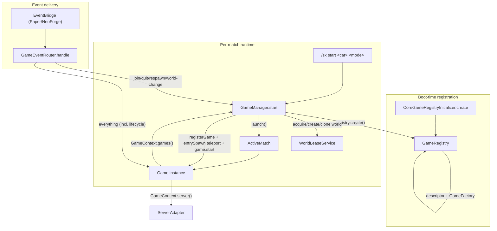
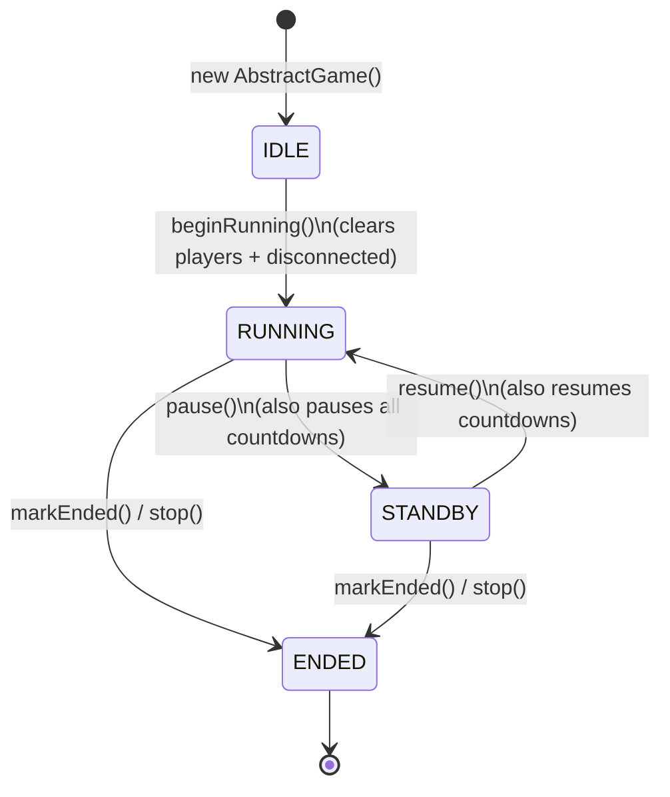
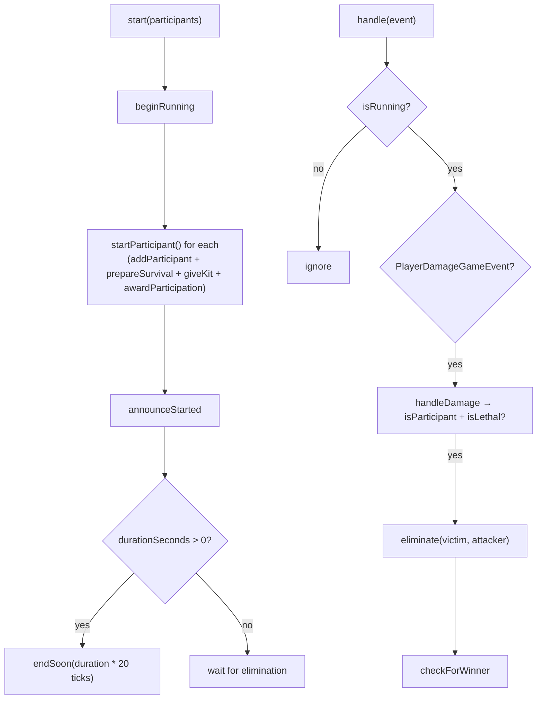

# Game Framework

The game framework is the platform-agnostic **match engine** in
[`packages/core/src/main/java/com/sexidium/core/game`](../../packages/core/src/main/java/com/sexidium/core/game)
(plus the [`event`](../../packages/core/src/main/java/com/sexidium/core/event) package and
[`util/Countdown`](../../packages/core/src/main/java/com/sexidium/core/util/Countdown.java)). It registers
game *modes*, launches a mode as a *match* bound to a (usually temporary) world, ticks
countdowns/timers, routes native Minecraft events into the active game(s), and tears everything down
when a match ends or a player leaves. Nothing in this package references Bukkit or NeoForge — games
talk only to the platform SPI (`ServerAdapter`, `PlayerAdapter`, `WorldAdapter`, …) and to immutable
model records, so the identical engine runs on both the Paper and NeoForge adapters.

**Scope.** This doc covers the **engine only**. For the concrete game *content* see
[minigames.md](../gameplay/minigames.md) (the 5 minigames) and
[experiences.md](../gameplay/experiences.md) / [experiences.md](../gameplay/experiences.md)
(experience challenges and their composition pipeline, which are owned by `ExperienceGame`, not the
framework). For the SPI itself see [platform-and-adapters.md](platform-and-adapters.md).

---

## Entry policy: how a mode controls arrival

`Game.entryPolicy(player)` returns an `EntryPolicy` — the game mode a player arrives in, whether they are
healed, fed and emptied on the way, whether their client renders hardcore hearts, and whether the mode is
re-asserted for as long as they stay. Default `EntryPolicy.SURVIVAL`, which is exactly what every mode did
before the API existed, so a mode that says nothing is unchanged.

| Factory | Mode | Heals | Feeds | Clears inventory | Enforced |
|---|---|---|---|---|---|
| `EntryPolicy.SURVIVAL` | Survival | yes | yes | yes | no |
| `EntryPolicy.spectator(notice)` | Spectator | no | no | no | **yes** |
| `EntryPolicy.creative(notice)` | Creative | yes | yes | no | no |
| `EntryPolicy.adventure(notice)` | Adventure | yes | yes | yes | no |

Modifiers: `withNotice`, `withHardcoreView(boolean)`, `alwaysEnforced()`.

**It is declared, not enforced by the mode.** The framework applies it on all three ways in —
`GameLauncher.launch` (fresh start), `PlayerSessionCoordinator.admit` (join) and
`PlayerSessionCoordinator.handleJoin` (reconnect) — and applies it **last**, after the game has finished
admitting the player, including restoring a saved snapshot. That ordering is the whole point:

> A player's game mode used to be decided by whoever touched them last on the way in — the host forcing
> survival, the snapshot restoring what they had when they left, a service setting something else a tick
> later. Three writers, no agreed order. The visible symptom was a player walking back into a hardcore
> world they had permanently lost, in survival, able to keep playing it.

**Three moments, not one.** Ordering alone turned out to be too weak a promise, so a policy has three
application points and each exists because something was getting past the others:

1. `prepareArrival(player, target)` — **before** the entry teleport, and only when that teleport actually
   leaves the current world. This is where `setHardcoreView` is sent, because a client is told what a
   world is when it is *sent* the world; saying it at any other moment would leave the client without a
   loaded world. `EntryPolicy.leaveHardcoreWorld(player, lobbySpawn)` is the counterpart on every release
   to the lobby, and is called from `PlayerSessionCoordinator.releaseToLobby`, `AbstractGame`'s
   release-and-reset, and the world layer's evacuation — the lobby is never hardcore.
2. `applyTo(player)` — **last** on the way in: game mode, and health/food if the policy asks.
3. `enforce(player)` — for as long as they stay, from the mode's own timer (`ExperienceGame` runs it once
   a second). Writes only when the mode is actually wrong, so an obeyed policy costs one comparison per
   player per second and issues no `setGameMode` at all. Only an `enforced()` policy does anything here,
   so an ordinary world never fights an operator over their own game mode.

### Hardcore is a reusable rule, not one mode's private block

`HardcoreRule` (`core/game/hardcore`) is the bookkeeping half any `Game` can own: whether the mode is
hardcore, the world flag pushed across every dimension, the cached one-way "this world is lost" fact
(read/written through a `Ledger` so a mode without a database row passes `Ledger.MEMORY`), and — the part
that used to be hard-coded — a `HardcoreDeathOutcome`:

| Outcome | A death means | Marks the registry `dead`? |
|---|---|---|
| `LOSE_WORLD` (default) | the world can only be spectated from now on | yes, once, one-way |
| `RESET_WORLD` | the world is thrown away and regenerated; the run continues | **never** |

`recordDeath()` answers "is this the death that ends the world", which is false for every death after the
first and false for *every* death under `RESET_WORLD` — that single line is what stops a mode that
intends to continue from permanently locking its owner out of its own experience.

The mode keeps only what is specific to it: what to announce, and who to move where.
`ExperienceGame` delegates the rest; an experience challenge can force the stakes on with
`Challenge#requiresHardcore()` (read at world-creation time, like the void-world flags, so the world is
*born* hardcore) and choose the outcome with `Challenge#hardcoreDeathOutcome()`.

Failures are contained: a policy that throws is logged and the player still enters. `applyTo` is a set,
never a toggle, so applying it repeatedly (entry, then again after a restore) is safe. An offline or null
player is ignored. `EntryPolicyTest` locks all of this down.

**Rule for new modes:** if arrival should look like anything other than "alive and playing", override
`entryPolicy` — do not call `setGameMode` from your own entry path, because something after you will
overwrite it. If the mode must *stay* true (a world that may only be watched), say `alwaysEnforced()` and
drive `enforce` from a timer rather than trying to catch every path that could undo it.


## 1. The big picture



| Class | File | Role |
|-------|------|------|
| `Game` | [`Game.java`](../../packages/core/src/main/java/com/sexidium/core/game/Game.java) | Interface every mode implements. |
| `AbstractGame` | [`AbstractGame.java`](../../packages/core/src/main/java/com/sexidium/core/game/AbstractGame.java) | Base class: player set, state, timer/overlay tracking, generic snapshot, cleanup. |
| `BaseTimedGame` | [`modes/BaseTimedGame.java`](../../packages/core/src/main/java/com/sexidium/core/game/modes/BaseTimedGame.java) | Timed-elimination lifecycle. Base of `MinigameMode` (not of `ExperienceGame`). |
| `MinigameMode` | [`modes/MinigameMode.java`](../../packages/core/src/main/java/com/sexidium/core/game/modes/MinigameMode.java) | `BaseTimedGame` + team allocation + mode-arg parsing; `configPrefix()` = `minigames.<id>`. |
| `GameFactory` | [`GameFactory.java`](../../packages/core/src/main/java/com/sexidium/core/game/GameFactory.java) | `@FunctionalInterface`: `Game create(GameContext, String requestedModeId, List<String> modeArgs)`. |
| `GameModeDescriptor` | [`GameModeDescriptor.java`](../../packages/core/src/main/java/com/sexidium/core/game/GameModeDescriptor.java) | Metadata record (id, category, displayName, minPlayers, aliases, hologramLines). |
| `GameRegistry` | [`GameRegistry.java`](../../packages/core/src/main/java/com/sexidium/core/game/GameRegistry.java) | Maps normalized id/aliases → descriptor + factory. |
| `CoreGameRegistryInitializer` | [`CoreGameRegistryInitializer.java`](../../packages/core/src/main/java/com/sexidium/core/game/CoreGameRegistryInitializer.java) | Registers the 5 minigames + the single `experience` mode. |
| `GameManager` | [`GameManager.java`](../../packages/core/src/main/java/com/sexidium/core/game/GameManager.java) | Orchestrator (implements `MatchLauncher`): start/launch/end, player index, reconnect. |
| `GameContext` | [`GameContext.java`](../../packages/core/src/main/java/com/sexidium/core/game/GameContext.java) | Dependency carrier handed to every game. |
| `ActiveMatch` | [`ActiveMatch.java`](../../packages/core/src/main/java/com/sexidium/core/game/ActiveMatch.java) | Immutable handle bundling matchId, mode, game, world lease. |
| `GameState` | [`GameState.java`](../../packages/core/src/main/java/com/sexidium/core/game/GameState.java) | `IDLE`, `RUNNING`, `STANDBY`, `ENDED`. |
| `Countdown` | [`util/Countdown.java`](../../packages/core/src/main/java/com/sexidium/core/util/Countdown.java) | Self-contained 1-second-tick boss-bar timer. |
| `GameEvent` / `GameEventRouter` | [`event/`](../../packages/core/src/main/java/com/sexidium/core/event) | Sealed event hierarchy + dispatcher. |

---

## 2. `Game`, `AbstractGame`, and `GameFactory`

### `Game` (the contract)

[`Game.java`](../../packages/core/src/main/java/com/sexidium/core/game/Game.java) is the interface the
`GameManager` and `GameEventRouter` talk to. Required methods are `id()`, `displayName()`,
`minPlayers()`, `start(List<PlayerAdapter>)`, `stop(LocalizedText)`, and `state()`. Everything else is
a `default` no-op so a mode overrides only what it needs:

| Default method | Purpose |
|----------------|---------|
| `handle(GameEvent)` | React to a routed event. No-op by default. |
| `isEmpty()` / `onlineCount()` | Drive empty-match cleanup. |
| `isReconnectable()` | `false`. Return `true` to opt into persistence/reconnect. |
| `onParticipantDisconnect` / `onParticipantRejoin` | Reconnect hooks. |
| `onParticipantAdded` / `onParticipantRemoved` | Mid-match join / leave hooks. |
| `releasePlayerUi(PlayerAdapter)` | Hide *this match's* overlays for one player. |
| `allowsWorldChange(player, from, to)` | `false`; return `true` to let a participant cross worlds (e.g. Fugitive between dimensions). |
| `entrySpawn(player, world)` (`Game.java:56`) | Where the launcher teleports a (re)entering participant. Default = world spawn; `ExperienceGame` returns the player's **saved/validated** position. Returning `null` skips the teleport. |
| `handlesOwnRespawn()` (`Game.java:79`) | `false`. `true` keeps a respawning player in the match instead of ejecting them (open-ended experiences). |
| `worldTemplate()` (`Game.java:88`) | `null`. Non-null names a template world the match is **cloned** from (e.g. TNT War's pre-built arena). |
| `writeSnapshot` / `restore` | Persistence hooks. Now *implemented generically* by `AbstractGame` (§8). |

### `AbstractGame` (the base class)

[`AbstractGame.java`](../../packages/core/src/main/java/com/sexidium/core/game/AbstractGame.java) is what
every concrete mode ultimately extends. It owns:

- `Set<UUID> players` (a `LinkedHashSet`) — the game's own participant set, **independent of**
  `GameManager.playerIndex`.
- `Set<UUID> disconnectedPlayers` — participants who quit but may reconnect.
- `GameState state` — defaults to `IDLE`.
- Tracked lists of `ScheduledTask`, `Countdown`, `BossBarHandle`, `HudPanelHandle`.
- `Map<UUID, PlayerSnapshot> playerStates` and a `pendingRestore` flag for reconnect.

The tracked lists are the heart of automatic cleanup. Every timer/overlay a mode creates **must** go
through a tracking helper so `cleanup()` can tear it down:

| Helper (in `AbstractGame`) | What it does |
|---------------------------|--------------|
| `runTimer(r, delay, period)` / `runLater(r, delay)` | Wrap `scheduler()` and add the task to `scheduledTasks`. |
| `track(Countdown)` / `track(BossBarHandle)` / `track(HudPanelHandle)` | Register an overlay for cleanup. `track(HudPanelHandle)` returns `HudPanelHandle.NOOP` if given `null`. |
| `timerBar(key, seconds, color, …)` | Build + track a `Countdown` and start it for the current `online()` players. |
| `cleanup()` (`AbstractGame.java:487`) | Cancel every scheduled task, `stop()` every countdown, `close()` every boss bar and HUD panel. |

Other notable helpers: `prepareSurvival()` (heal + food 20 + SURVIVAL), `giveKit()`,
`releaseAndReset()` (`AbstractGame.java:296`: `releasePlayerUi` → `resetStatuses` → teleport to lobby →
re-point compass), `release`/`releaseToLobby`, `releasePlayerUi` / `restorePlayerUi`,
`endSoon(delayTicks)` (guards `games().contains(this)`), the `awardParticipation/awardKill/awardWin`
rank shims, and `isLethal()` (`health - finalDamage <= 0`).

### `GameFactory`

A one-method functional interface (`GameFactory.java`):

```java
Game create(GameContext gameContext, String requestedModeId, List<String> modeArgs);
```

Every registered factory passes `modeArgs` to its constructor — `RaceGame`, `GatherGame`, `TntWarGame`,
`CombatGame`, `FugitiveGame`, and `ExperienceGame` all take an args list (`CoreGameRegistryInitializer`).
The args carry team/format parsing for minigames and the challenge-id list for experiences.

---

## 3. `GameRegistry` + `CoreGameRegistryInitializer`

### `GameRegistry`

[`GameRegistry.java`](../../packages/core/src/main/java/com/sexidium/core/game/GameRegistry.java) keeps two
maps: `descriptorsByModeId` (canonical descriptors) and `modesByAlias` (every normalized id **and**
alias → `RegisteredMode{descriptor, factory}`).

The crucial detail is **`normalize()`** (`GameRegistry.java:49`): it lowercases the string and strips
`-`, `_`, and spaces, so `"double-drops"`, `"Double_Drops"`, and `"doubledrops"` all resolve to the
same mode. `register()` normalizes the mode id plus each alias; `create()` normalizes the requested id
before lookup and then invokes the factory, returning `Optional<Game>`.

### `CoreGameRegistryInitializer`

[`CoreGameRegistryInitializer.create()`](../../packages/core/src/main/java/com/sexidium/core/game/CoreGameRegistryInitializer.java)
builds a fresh `GameRegistry` and calls `register()` → `registerMinigames()` + `registerExperience()`.
The category constants are `CATEGORY_MINIGAMES = "minigames"` and `CATEGORY_EXPERIENCE = "experience"`
(**singular**, `CoreGameRegistryInitializer.java:14`). The adapters call
`CoreGameRegistryInitializer.create()` from their platform game-registry factory; there are no
platform-specific modes.

**Registered modes (6):**

| id | category | display name | minPlayers | aliases |
|----|----------|--------------|-----------:|---------|
| `race` | minigames | Race for Item | 1 | raceforitem, item |
| `gather` | minigames | Gather and Duel | 2 | duel, gatherandduel, gatherduel |
| `tntwar` | minigames | TNT War | 2 | tnt, war |
| `combat` | minigames | Combat Item Mode | 2 | kit, kitpvp |
| `fugitive` | minigames | Fugitive | 3 | manhunt, thefugitive, fled |
| `experience` | experience | Experience | 1 | exp, experiences |

The single `experience` mode (`ExperienceGame.MODE_ID`, `registerExperience()` at
`CoreGameRegistryInitializer.java:59`) is launched as `/sx start experience <challenge ids...>`; the
**challenge ids arrive as `modeArgs`** and are composed inside `ExperienceGame` — they are *not*
registered as standalone modes. The challenge catalog itself lives in
[experiences.md](../gameplay/experiences.md).

> The descriptor `category` is enforced by the admin `/sx start <category> <mode>` command: a mode whose
> descriptor category mismatches the requested category is rejected.

---

## 4. `GameManager` — lifecycle & state

[`GameManager.java`](../../packages/core/src/main/java/com/sexidium/core/game/GameManager.java) holds all
live state:

- `matches` : `matchId → ActiveMatch`
- `playerIndex` : `playerId → matchId`
- `pending` / `pendingIndex` : DB snapshots loaded at boot but not yet rehydrated.
- `reservingPlayers` : a `HashSet<UUID>` of players with an **in-flight async-world start** (not yet in
  `playerIndex`); it blocks a duplicate start for the same player, e.g. spam-clicking an NPC
  (`GameManager.java:36`).
- `starting` / `startingDisplayName` flags, surfaced via `isStarting()` / `startingDisplayName()` for
  in-flight-launch UI.

Its constructor calls `gameContext.attachGameManager(this)` (`GameManager.java:47`) so games reach the
manager via `gameContext.games()`.

### 4.1 Starting and launching a match

`start(modeId, participants, initiator, modeArgs)` (`GameManager.java:110`):

1. `create()` the game (unknown → `GAME_UNKNOWN_MODE`).
2. `sanitize()` participants (dedup + online-only); enforce `minPlayers` (`GAME_MIN_PLAYERS`).
3. Reject any already-indexed **or** reserving player (`GAME_ALREADY_RUNNING`).
4. **Reserve** all participants, set `starting = true`, then resolve a world by one of **four** paths:

| # | Condition | Action |
|---|-----------|--------|
| 1 | `worlds().enabled()` false | `launch()` with a `null` lease (match runs in-place). |
| 2 | `game.worldTemplate()` non-blank | `acquireOrCreateClone(template, …)` async — clones a pre-built arena (TNT War always; Race/Fugitive when maps are configured). |
| 3 | `acquireReady()` returns a pooled lease | `launch()` with the ready lease. |
| 4 | otherwise | `acquireOrCreate(…)` async, generating a fresh world. |

The shared `onWorldFailure` clears `starting`, frees the reservations, and sends `TEMP_WORLD_FAILED`.

`launch(modeId, game, lease, participants, initiator, modeArgs)` (`GameManager.java:647`): free the
reservations, re-`sanitize` + re-check `minPlayers` (on failure: close lease + clear `starting`), mint a
random `matchId`, build the `ActiveMatch`, populate `matches` + `playerIndex`, clear `starting`, call
`events().registerGame(game)`, teleport each participant via **`game.entrySpawn(participant,
leaseWorld)`** (not the raw world spawn), then `game.start(onlineParticipants)`. On any exception it
`endMatch()`es the match with `STOP_START_ERROR` (which also closes the lease). Finally it `persist()`s.

`startExperience(worldName, participants, initiator, challengeIds)` (`GameManager.java:189`) is a
**separate** entry point for player-owned **persistent** experience worlds: it requires ≥1 player and
uses `acquireOrCreatePersistent`, so the map survives emptiness and restarts and is never drawn from the
disposable temp pool nor auto-deleted.

### 4.2 Ending a match

`endMatch(ActiveMatch, reason)` (`GameManager.java:313`):

1. Guard membership, remove the match from `matches`.
2. Purge every `playerIndex` entry pointing at this match.
3. `game.stop(reason)` inside a try/catch.
4. `events().unregisterGame(game)`.
5. Close the `WorldLease` if present (discards the temp world).
6. `matchRepository.deleteAsync(matchId)` to drop any persisted snapshot.

> **Ordering note:** `playerIndex` is purged *before* `game.stop()`. Safe because `BaseTimedGame.stop()`
> iterates `online()`, which derives from the game's **own** `players` set, not from `playerIndex`.

`active()`, `isRunning()`, and `endActiveGame()` are convenience accessors that operate on the **first**
match only — a latent single-match assumption while the model supports concurrency (§9).

---

## 5. Player lifecycle hooks (called by `GameEventRouter`)

All operate on the player's match via `matchOf()`.

| Hook | What happens |
|------|--------------|
| `handleQuit` (`:348`) | `releasePlayerUi`. If **not** reconnectable → remove from index + `checkEmpty` (end-if-empty). If reconnectable → `onParticipantDisconnect`, `persist`, schedule `reconnectTimeout` after `max(1, reconnect.timeout-seconds [default 120]) × 20` ticks. |
| `handleJoin` (`:369`) | Resolve live match (or `rehydrate` a pending snapshot). If the player is not in the match world (compared via `WorldNaming.sameWorld`), teleport via `game.entrySpawn(player, world)` — a **validated** position, not the raw spawn — then `onParticipantRejoin` + `persist`. Returns `boolean`. |
| `handleRespawn` (`:419`) | If `game.handlesOwnRespawn()` is true → **return** (the game keeps the player in-world). Otherwise `releasePlayerUi` + `releaseToLobby`. |
| `handleChangedWorld` (`:436`) | If the player left the match world (via `WorldNaming.sameWorld`) and `!game.allowsWorldChange(...)` → `removePlayer(voluntary=true)`. |
| `removePlayer(UUID, voluntary)` (`:394`) | If no live match but a pending one → `discardPending`. Else remove from index, `onParticipantRemoved`, and for an online player `releasePlayerUi` + `releaseToLobby`; `persist` if the match still exists and isn't empty. |

`releaseToLobby` (`:733`) teleports to `worlds().lobbySpawn()` and re-points the compass; if no lobby
spawn is resolvable it logs a warning and bails rather than stranding the player in a doomed match world.

---

## 6. Mid-match join (`enterMatch` / `joinInProgress`)

`enterMatch(player, ActiveMatch)` admits a player directly to a **specific** live match (used to
enter/resume a specific experience). Gates: online (`PLAYER_OFFLINE`), match still live (`NOT_RUNNING`),
not already in a match (`ALREADY_IN_MATCH`).

`joinInProgress(player, modeId, relatedPlayerIds)` (`GameManager.java:487`) joins a running match **of a
mode**. When `relatedPlayerIds` is non-null the joiner may enter only a match that already contains one
of those players (their party / friends), else `JoinResult.NOT_RELATED`; a `null` set means no
relationship restriction (internal/admin). This is the social gate the old doc reported as missing.

```java
public enum JoinResult { JOINED, NOT_RUNNING, NOT_RELATED, ALREADY_IN_MATCH, PLAYER_OFFLINE }
```

`admit(player, match)` (`GameManager.java:524`): `resetStatuses`, index the player, teleport via
`game.entrySpawn`, `game.onParticipantAdded(player)` in a try/catch, `persist`.

`matchByWorldName(worldName)` matches on the **last path segment** (experience live world names are
slash paths like `worlds/experiences/exp_ab12` while callers pass the bare id), so a second joiner finds
the existing experience match instead of starting a parallel one. `findRunningMatchByMode` returns the
**first** match of a mode id, so with multiple concurrent same-mode matches a joiner still can't target a
specific one (§9).

---

## 7. `GameState` and transitions

[`GameState.java`](../../packages/core/src/main/java/com/sexidium/core/game/GameState.java) has four
values: `IDLE`, `RUNNING`, `STANDBY` (paused), `ENDED`.



Transition mechanics (all in `AbstractGame`):

- **`beginRunning()`** (`AbstractGame.java:83`) — `players.clear()`, `disconnectedPlayers.clear()`,
  `state = RUNNING`. Called first in `BaseTimedGame.start()`, **before** participants are re-added. This
  is why `GameManager.playerIndex` and `AbstractGame.players` are populated by two independent paths — a
  mode whose `start()` forgets to re-add participants leaves `players` empty while `playerIndex` is
  populated, breaking `online()`/`isParticipant`.
- **`pause()`** — sets `paused`, flips `RUNNING → STANDBY`, and `pause()`s every tracked countdown.
- **`resume()`** — clears `paused`, flips `STANDBY → RUNNING`, and `resume()`s countdowns.
- **`markEnded()`** — `state = ENDED`.

`isRunning()` (`state == RUNNING`) gates `BaseTimedGame.handle()`: a STANDBY game stops reacting to
events and its countdowns freeze. `FugitiveGame` uses pause/resume to freeze a manhunt while the
fugitive is disconnected.

---

## 8. Persistence / reconnect (pending sessions)

> **Reconnect is live, not inert.** `BaseTimedGame.isReconnectable()` (`BaseTimedGame.java:57`) returns
> `cfg().getBoolean("reconnect.enabled", true)`, so **all** minigames and experiences are reconnectable
> by default (`FugitiveGame` still overrides it but is no longer the only reconnectable mode).
> `AbstractGame` supplies the **generic** capture/restore machinery used below.

- `AbstractGame.writeSnapshot()` (`AbstractGame.java:412`) captures live per-player state
  (inventory/health/position/gamemode/role via `PlayerSnapshot.captureLive`) for every participant, then
  calls `writeModeData(Props)`. `AbstractGame.restore()` (`AbstractGame.java:441`) marks `RUNNING`,
  re-adds participants as disconnected, flags `pendingRestore`, and calls `restoreModeData(Props)`. Mode
  hooks for custom state: `roleOf`, `writeModeData`, `restoreModeData`. `onParticipantRejoin` re-applies
  saved state for restart-rehydrated matches.
- `importPersisted(snapshots)` stages DB snapshots into `pending`/`pendingIndex` at boot.
- `prepareShutdown()`: for each reconnectable match, save the snapshot (players marked `DISCONNECTED`)
  via `matchRepository.saveBlocking` and `preserveSingle(worldName)`; non-reconnectable matches are
  `endMatch`'d with `STOP_SERVER_SHUTDOWN`.
- `rehydrate(matchId)` (`GameManager.java:751`): reacquire the world (`reacquirePersistent` for
  experience worlds, `reacquireByName` otherwise; `null` worldName → no lease), recreate the game from
  the registry, `events().registerGame`, repopulate `playerIndex`, and `game.restore(snapshot)`. On
  failure → `discardPending`.
- `discardPending(matchId, playerId)` (`GameManager.java:567`): drop the pending entry; delete its world
  via `discardByName` **unless** it is an `ExperienceGame` world (persistent, player-owned, never deleted
  on a stale sweep). `discardStalePending` sweeps all pending entries.
- `persist(ActiveMatch)` (`GameManager.java:704`) is a no-op unless `game.isReconnectable()`; it uses
  `saveAsync`.
- `protectedWorldNames()` / `pendingWorldNames()` expose world names that temp-world GC must not reap
  (live + reconnect-pending matches).

---

## 9. `ActiveMatch`, `GameModeDescriptor`, `BaseTimedGame` & `Countdown`

### `ActiveMatch`

[`ActiveMatch.java`](../../packages/core/src/main/java/com/sexidium/core/game/ActiveMatch.java) is an
immutable per-match handle: `matchId` (random), `modeId`, `modeArgs` (immutable copy), `game`,
`worldLease` (may be `null`), `createdAt`. `world()` / `worldName()` resolve through the lease (`null` if
no lease). `buildSnapshot()` (`ActiveMatch.java:60`) fills the match-level fields then delegates per-player
rows to `game.writeSnapshot(snapshot)`.

### `GameModeDescriptor`

A record `(modeId, category, displayName, minPlayers, aliases, hologramLines)`
(`GameModeDescriptor.java`). The canonical constructor copies `aliases` (null → empty); a 5-arg
convenience constructor passes `null` `hologramLines`. The `hologramLines()` accessor
(`GameModeDescriptor.java:29`) falls back to `MinigameHologramSpec.standard(this)` when none were
supplied, so every mode always has a standardized lobby-NPC hologram with no per-mode config.

### `BaseTimedGame`

[`BaseTimedGame.java`](../../packages/core/src/main/java/com/sexidium/core/game/modes/BaseTimedGame.java)
supplies the timed-elimination lifecycle. Its only practical subclass path is `MinigameMode` → the
concrete minigames. **`ExperienceGame` extends `AbstractGame` directly** (not `BaseTimedGame`) and does
*not* use the `configPrefix()` scheme — it reads config under `experiences.common.*` and
`experiences.modes.*` (see [experiences.md](../gameplay/experiences.md)).



- `start()` (`:20`) — `beginRunning()`; per participant `startParticipant()` (addParticipant +
  prepareSurvival + `giveKit(configuredKit())` + awardParticipation); `announceStarted()`; if
  `durationSeconds() > 0` then `endSoon(duration * 20)`.
- `stop()` (`:34`) — `markEnded()`; `releaseAndReset()` each online player; `cleanup()`;
  `clearParticipants()`.
- `handle()` (`:44`) — returns unless `isRunning()`, then routes `PlayerDamageGameEvent → handleDamage`,
  which filters to `isParticipant(victim) && isLethal(...)` before `eliminate`. `eliminate` removes the
  victim, awards the attacker a kill if the attacker is also a participant, then `checkForWinner()`.
- `checkForWinner()` (`:133`) — declares a win when `remainingOnlineParticipants().size() == 1` **and**
  `players.size() <= 1`; a no-winner end when both are empty.
- `finishWithWinner(winner)` and `requestEnd()` (`:150`: `endMatch` if the manager still contains this
  game, else `markEnded`) are the explicit-end paths.

**Config namespacing:** `BaseTimedGame.configPrefix()` = `games.<id>`; `MinigameMode` overrides it to
`minigames.<id>`. The base reads `<prefix>.kit` and `<prefix>.duration-seconds`. `BaseTimedGame` also has
`tunableInt`/`tunableBoolean`/`tunableString` helpers (`:102`) that read a per-mode key and fall back to a
global `game.*` key, so a value lives in one place but a single mode can diverge.

### `Countdown`

[`Countdown.java`](../../packages/core/src/main/java/com/sexidium/core/util/Countdown.java) is a
self-contained boss-bar timer:

- `start(viewers)` creates a boss bar and `runTimer(this::tick, 0, 20)` (1 tick per second).
- `tick()` (`:104`): does nothing if stopped/paused; at `<= 0` fires `onComplete` and `stop()`s;
  otherwise updates title/progress, fires `onSecond`, and decrements.
- `addViewer` / `removeViewer` show/hide the bar **per player**; `pause` / `resume` flip a flag;
  `format()` renders `m:ss`.

Games use `AbstractGame.timerBar(...)` rather than instantiating `Countdown` directly.

---

## 10. The event package (`GameEvent` flow)

### The sealed hierarchy

[`GameEvent.java`](../../packages/core/src/main/java/com/sexidium/core/event/GameEvent.java) is a sealed
interface:

```java
public sealed interface GameEvent permits CancellableGameEvent, EntityDeathGameEvent, MobDamageGameEvent,
    PlayerAdvancementGameEvent, PlayerChangedWorldGameEvent, PlayerJoinGameEvent, PlayerQuitGameEvent,
    PlayerRespawnGameEvent, PlayerToggleSneakGameEvent {}
```

Cancellable events extend `non-sealed CancellableGameEvent` (via `AbstractCancellableGameEvent`, which
stores the `cancelled` flag), so they are not listed in the `permits` clause directly.

| Event | Cancellable? | Carries |
|-------|:------------:|---------|
| `PlayerJoinGameEvent` | no | player |
| `PlayerQuitGameEvent` | no | player |
| `PlayerRespawnGameEvent` | no | player |
| `PlayerChangedWorldGameEvent` | no | player, fromWorld, toWorld |
| `PlayerToggleSneakGameEvent` | no | player, sneaking |
| `PlayerAdvancementGameEvent` | no | player, advancement key |
| `EntityDeathGameEvent` | no | entityType, deathPosition |
| `MobDamageGameEvent` | no | `MobHandle` mob, attacker, amount — fires when a **mob** is the victim and a player the attacker (drives experience challenges like "mobs duplicate when hit") |
| `BlockBreakGameEvent` | **yes** | player, blockPosition, blockKey, **dropItems** flag |
| `BlockPlaceGameEvent` | **yes** | player, placed block |
| `PlayerInteractGameEvent` | **yes** | player, action, item, clicked block |
| `PlayerDamageGameEvent` | **yes** | victim, attacker, damageCause, finalDamage |
| `PlayerMoveGameEvent` | **yes** | player, from/to |
| `InventoryChangeGameEvent` | **yes** | player |

For cancellable events, the platform EventBridge writes the `cancelled()` flag (and, for
`BlockBreakGameEvent`, the `dropItems()` flag) back onto the native event after routing, so a game can
veto a vanilla action by calling `setCancelled(true)` inside `handle()`.

### Routing

[`GameEventRouter`](../../packages/core/src/main/java/com/sexidium/core/event/GameEventRouter.java) takes
`(ServerAdapter, GameManager, LobbyManager)`. Its `handle()` switch-dispatches:

- **Join / Quit / Respawn / ChangedWorld** are special-cased into the matching `GameManager` hook **and**
  routed to active games.
- **Everything else** goes straight to `routeToActiveGames()`.

`handleQuit` additionally calls `lobbyManager.onPlayerQuit(uuid)` to drop the player from their
lobby/queue (`GameEventRouter.java:48`).

**Join reconnect special case:** if the joining player has a persisted session, `handleJoin` schedules
`GameManager.handleJoin` **one tick later** (entity fully initialized) and messages `RECONNECT_RESTORED`
on success; otherwise the join is routed to active games immediately (`GameEventRouter.java:33`).

`routeToActiveGames()` (`GameEventRouter.java:71`) iterates a **copy** of `gameManager.matches()` and
calls `game.handle(event)` on **every** active match.

> **Important consequence:** every non-lifecycle event is broadcast to *all* active games. Each mode must
> self-filter by `isParticipant`/world (as `BaseTimedGame.handleDamage` does). `registerGame` /
> `unregisterGame` on the `EventDispatcherAdapter` are **no-ops** on both platforms — event delivery does
> not depend on per-game subscription, and event isolation is purely the game's responsibility (§11).

---

## 11. How to add a new mode

1. **Write the game class.** Extend `MinigameMode` or `ExperienceGame` (both ultimately `AbstractGame`).
   - Call the right super constructor `(gameContext, modeId, displayName, minPlayers)`.
   - Override `start()` (call `super.start()` first so `beginRunning` + `startParticipant` + announce
     run) and `stop()` if you need extra teardown.
   - Override `handle(GameEvent)` **always** guarding on `isRunning()` (or `super.handle`) and
     `isParticipant(...)`/world, because every event is broadcast to every match.
   - Create timers/overlays **only** via `runTimer`/`runLater`/`timerBar`/`track(...)` so `cleanup()` can
     release them. Read config under `configPath("…")`.
   - Consider the SPI knobs a mode may override: `entrySpawn` (control the entry teleport), `worldTemplate`
     (clone a pre-built arena), `handlesOwnRespawn` (keep a player in-world on death), `allowsWorldChange`
     (cross worlds).

   ```java
   public final class MyMode extends MinigameMode {
     public MyMode(GameContext ctx, List<String> args) { super(ctx, "mymode", "My Mode", 2, args); }

     @Override public void start(List<PlayerAdapter> participants) {
       super.start(participants);                // beginRunning + per-player setup + announce
       timerBar(MessageKey.MY_TIMER, 60, BossBarColor.GREEN, this::onTimeUp);
     }

     @Override public void handle(GameEvent event) {
       super.handle(event);                      // lethal-damage elimination
       if (event instanceof BlockBreakGameEvent e && isParticipant(e.playerAdapter())) {
         // ... mode logic, e.g. e.setCancelled(true) to veto the break
       }
     }
   }
   ```

2. **Register it.** Add a `registry.register(...)` call in `CoreGameRegistryInitializer` under the right
   category constant, with a `GameModeDescriptor` and a `GameFactory` lambda:

   ```java
   registry.register(new GameModeDescriptor(
       "mymode", CATEGORY_MINIGAMES, "My Mode", 2, List.of("mm", "my-mode")),
       (ctx, id, args) -> new MyMode(ctx, args));
   ```

3. **Add config + messages.** Add the keys you read under the matching prefix (`minigames.mymode.*` or
   `experiences.modes.mymode.*`) to `config.yml`, and any `MessageKey` you announce to the localization
   files.

The registry is platform-agnostic, so the new mode is immediately available on both Paper and NeoForge
with no adapter changes. If your mode needs a platform capability that is a `default` no-op in the SPI,
verify both adapters implement it — see [platform-and-adapters.md](platform-and-adapters.md).

---

## 12. Validation notes (residual issues)

- **[Medium] `joinInProgress` cannot target a specific match.** `findRunningMatchByMode` returns the
  **first** match of a mode id, so with multiple concurrent same-mode matches a joiner can't choose.
- **[Medium] All non-lifecycle events broadcast to every active game.** `routeToActiveGames`
  (`GameEventRouter.java:71`) calls `game.handle()` on every match; `registerGame`/`unregisterGame` are
  no-ops on both platforms. A mode reacting to a global event (EntityDeath, Advancement, BlockBreak, …)
  without `isParticipant`/world checks will react to other matches' (or the lobby's) actions.
- **[Low] `checkForWinner` couples online-count and raw set size.** It requires
  `remaining(online).size() == 1` **and** `players.size() <= 1`; a disconnected-but-not-removed
  participant keeps `players.size() > 1` and suppresses the last-player win until reconciled.
- **[Low] `active()` / `isRunning()` / `endActiveGame()` collapse to the first match** while the data
  model genuinely supports concurrency.
- **[Info] `endMatch` purges `playerIndex` before `game.stop()`** — safe only because `stop()` iterates
  the game's own `players` set, not `playerIndex`.
- **[Info] `beginRunning()` clears `players` after `launch()` already populated `playerIndex`** — the two
  are populated by independent paths; a `start()` that forgets to re-add participants breaks
  `online()`/`isParticipant`.

> **Resolved since the previous revision:** mid-match join now has a party/friend gate (`relatedPlayerIds`
> + `NOT_RELATED`, §6); `handleRespawn` no longer unconditionally ejects respawners (`handlesOwnRespawn`,
> §5); persistence/reconnect is functional (`AbstractGame` generic capture/restore + config-gated
> `isReconnectable`, §8).

---

## Keeping this current

The **code is the source of truth**; this doc is a derived view. Authoritative files for this domain:
[`game/`](../../packages/core/src/main/java/com/sexidium/core/game) (especially `GameManager.java`,
`AbstractGame.java`, `Game.java`, `GameRegistry.java`, `CoreGameRegistryInitializer.java`,
`GameModeDescriptor.java`, `ActiveMatch.java`, `GameState.java`, `modes/BaseTimedGame.java`),
[`event/`](../../packages/core/src/main/java/com/sexidium/core/event) (`GameEvent.java`,
`GameEventRouter.java`), and [`util/Countdown.java`](../../packages/core/src/main/java/com/sexidium/core/util/Countdown.java).
Update **this doc in the same change** that touches those files. Triggers: a new class/file in the game
or event package, a new/removed registered mode in `CoreGameRegistryInitializer`, a new `Game` SPI method
or signature/behavior change, a new `GameEvent` permit, or a config key added/removed under
`games.*` / `minigames.*` / `reconnect.*`. Game *content* changes (individual minigames/challenges) belong
in [minigames.md](../gameplay/minigames.md) / [experiences.md](../gameplay/experiences.md), not here.
