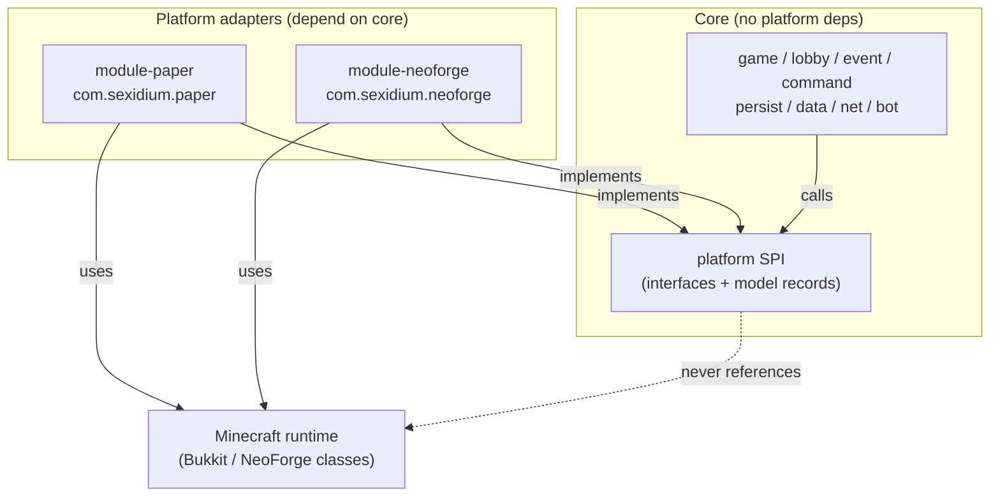
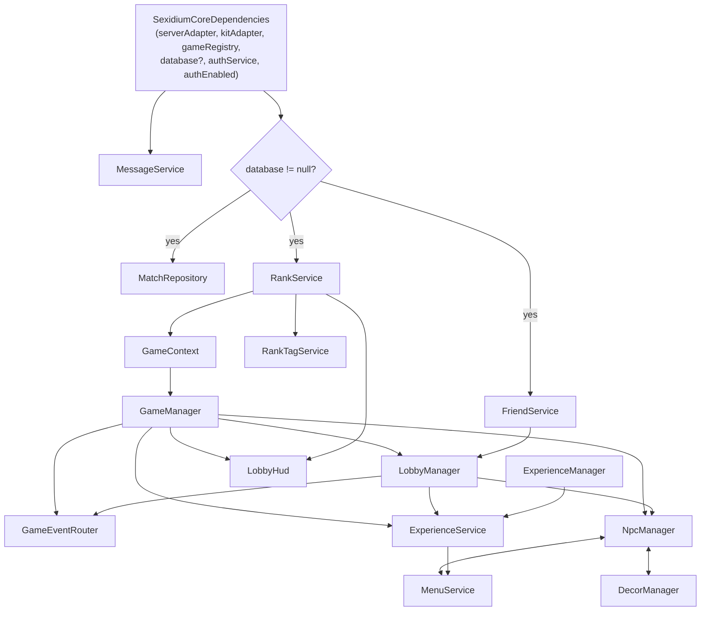

# Sexidium System Architecture

> Audience: new contributors. This is **the map**: how Sexidium is split into a platform-agnostic core plus thin adapters, how `SexidiumCore` wires every subsystem together, the startup/shutdown ordering, and a one-line inventory of every subsystem with a pointer to the sibling doc that covers it in depth.
>
> For the full catalogue of SPI interfaces, model records, and per-method contracts, see [platform-and-adapters.md](platform-and-adapters.md). This document references siblings rather than duplicating them.

---

## 1. The big idea: platform-agnostic core + thin adapters

Sexidium runs on **two unrelated server platforms** that share almost no API surface:

- **Paper** (Bukkit/Adventure API) — `packages/module-paper` — `com.sexidium.paper`
- **NeoForge** (vanilla Minecraft + mod loader, reflection-based) — `packages/module-neoforge` — `com.sexidium.neoforge`

Rather than fork gameplay per platform, *all* game logic, command handling, matchmaking, lobbies, persistence, ranks, auth, and the HTTP/Discord bridge live in one platform-agnostic core:

- **Core** — `packages/core` — `com.sexidium.core`

A TypeScript Discord bot runs **out of process** (`../bot`), launched and supervised by the core's `BotManager`.

```
packages/
  core/                 com.sexidium.core      <- ALL logic, zero platform deps
  module-paper/         com.sexidium.paper     <- Bukkit/Adventure SPI impl
  module-neoforge/      com.sexidium.neoforge  <- reflection-based vanilla SPI impl
  ../bot/               TypeScript Discord bot (out-of-process child)
```

### Why this split?

| Goal | How the split delivers it |
|------|---------------------------|
| **Write gameplay once** | A mode like `FugitiveGame` or an experience challenge runs unchanged on Paper and NeoForge because it is authored against `PlayerAdapter`/`WorldAdapter`, never a platform class. |
| **Isolate platform churn** | Bukkit API breaks and NeoForge mapping changes are absorbed inside the adapter modules; core never recompiles for a platform bump. |
| **Testability** | Core is unit-testable headless using POJO fake adapters — every dependency is an interface, and `platform/noop` provides safe no-op defaults. |
| **Parity by construction** | Both adapters implement the same SPI, so behavior is identical unless an adapter diverges; divergence shows up as "adapter X overrides/omits method Y". |

### Dependency direction (strict, one-way)



**The rule:** `adapters → core`, and within core `logic → SPI`. Compile-time enforced — `packages/core/build.gradle.kts` declares **zero** Bukkit/Paper/NeoForge/Minecraft dependencies, so a stray `import org.bukkit.*` in core would not compile.

---

## 2. The SPI: how core obtains platform capabilities

Every platform capability is a pure-Java interface in `com.sexidium.core.platform`. The single root is **`ServerAdapter`** (`platform/ServerAdapter.java:11`); each adapter builds exactly one concrete `ServerAdapter`, and every other sub-adapter is reachable from it.

```java
// Required accessors (ServerAdapter.java):
String serverName();  PlatformType platformType();  Path dataDirectory();
ConfigurationAdapter configuration();  LoggerAdapter logger();  ResourceAdapter resources();
SchedulerAdapter scheduler();  UiAdapter ui();  MessageAdapter messages();
EventDispatcherAdapter events();  CommandDispatcherAdapter commands();  WorldLeaseService worlds();
CommandSource console();
Collection<PlayerAdapter> onlinePlayers();  Optional<PlayerAdapter> player(UUID);  Optional<PlayerAdapter> playerExact(String);

// Optional capability seams — Java default methods that no-op on a partial adapter:
default String           itemTranslationKey(ItemKey);          // "" => caller falls back to a plain name
default InventorySerializer inventorySerializer();             // NOOP
default MenuAdapter      menus();    // NOOP  (Paper: InvUI; NeoForge: vanilla container)
default NpcAdapter       npcs();     // NOOP  (Paper: FancyNpcs; NeoForge: native)
default DecorAdapter     decor();    // NOOP  (ItemDisplay/BlockDisplay/Interaction)
default RankTagAdapter   rankTags(); // NOOP  (coloured scoreboard-team name tags)
```

The five default `NOOP` seams (`menus`/`npcs`/`decor`/`rankTags`/`inventorySerializer`) are exactly the SPI surfaces behind the menu, NPC, decor, rank-tag, and reconnect subsystems — a platform that omits them compiles and degrades silently (see §8).

Two techniques keep the SPI platform-agnostic, both detailed in [platform-and-adapters.md](platform-and-adapters.md):

1. **Values cross as immutable records, never live handles.** A position is `WorldPosition(worldName, x, y, z, yaw, pitch)` carrying a world **name string**; item identity is `ItemKey(namespace, value)`; sounds are `SoundKey`. Worlds are resolved by name via `WorldAdapter`/`WorldLeaseService`.
2. **Optional capabilities are `default` no-ops** (the `NOOP` constants above), so a partial adapter still builds.

### How a game reaches the SPI: `GameContext`

Games never touch `ServerAdapter` through globals — they receive a `GameContext` (`game/GameContext.java`):

```java
ServerAdapter        server();           // scheduler, ui, worlds, messages, events, players, config
KitAdapter           kits();
RankAwardPort        ranks();            // award participation/kills/wins (noop() when no DB)
GameManager          games();            // back-reference, attached in GameManager's ctor
ExperienceManager    experiences();      // attached from SexidiumCore (null in tests)
ExperienceStateStore experienceStore();  // file-backed per-world state (null in tests)
```

`attachGameManager(...)` is package-private and called from the `GameManager` constructor (`GameManager.java:47`); `attachExperiences`/`attachExperienceStore` are public and called from the `SexidiumCore` ctor right after `GameManager` is built.

---

## 3. The construction graph: `SexidiumCore` + `SexidiumCoreDependencies`

Each adapter builds a 6-field `SexidiumCoreDependencies` record (`SexidiumCoreDependencies.java`) and hands it to `new SexidiumCore(deps)`:

```java
new SexidiumCoreDependencies(
    serverAdapter,   // the one ServerAdapter impl
    kitAdapter,
    gameRegistry,    // CoreGameRegistryInitializer.create()
    database,        // SQLite Database, NULLABLE -> persistent features off
    authService,
    authEnabled);    // BooleanSupplier, defaults to () -> true
```

The `SexidiumCore` constructor (`SexidiumCore.java:45-92`) builds **every** subsystem in this fixed order. Services keyed *DB?* are `null` when `database == null`:

| # | Field | Construction (key wiring edges) | DB? |
|---|-------|---------------------------------|:---:|
| 1 | `messageService` | `MessageService(resources, configuration, logger)` | |
| 2 | `matchRepository` | `MatchRepository(logger, database)` | yes |
| 3 | `rankService` | `RankService(config, logger, messages, database, authService, authEnabled)` | yes |
| 4 | `friendService` | `FriendService(logger, database)` | yes |
| 5 | `authLoginService` | `AuthLoginService(config, logger, messageService, authService, authEnabled)` — always built (auth gates login independently of the DB) | |
| 6 | `apiServer` | `ApiServer(serverAdapter, rankService, authService)` | |
| 7 | `resourcePackServer` | `ResourcePackServer(serverAdapter)` | |
| 8 | `botManager` | `BotManager(serverAdapter, database)` | |
| 9 | `gameContext` | `GameContext(serverAdapter, kitAdapter, rankAwardPort)` where `rankAwardPort = rankService` or `RankAwardPort.noop()` | |
| 10 | `gameManager` | `GameManager(gameContext, gameRegistry, matchRepository)` | |
| 11 | `lobbyManager` | `LobbyManager(serverAdapter, gameManager, friendService)` — `gameManager` passed as the `MatchLauncher` seam, `friendService` as the `FriendGraph` seam | |
| 12 | `gameEventRouter` | `GameEventRouter(serverAdapter, gameManager, lobbyManager)` | |
| 13 | `experienceManager` | `ExperienceManager(logger, database)` → `gameContext.attachExperiences(...)` and `attachExperienceStore(new ExperienceStateStore(worlds().experiencesSubdir(), logger))` | |
| 14 | `experienceService` | `ExperienceService(serverAdapter, gameManager, experienceManager, lobbyManager, friendService)` | |
| 15 | `npcManager` | `NpcManager(serverAdapter, gameManager, lobbyManager)` | |
| 16 | `menuService` | `MenuService(serverAdapter, gameManager, lobbyManager, friendService, experienceService, npcManager)`; then `npcManager.setAdminEditorOpener(menuService::openNpcEditor)` | |
| 17 | `decorManager` | `DecorManager(serverAdapter, npcManager)`; then `npcManager.setDecorSync(decorManager::rebuildAndSpawn, ::respawnForNpc, ::removeForNpc)` | |
| 18 | `lobbyHud` | `LobbyHud(serverAdapter, gameManager, friendService, rankService)` | |
| 19 | `rankTagService` | `RankTagService(serverAdapter, rankService)` | |

`NpcManager` ↔ `MenuService` and `NpcManager` ↔ `DecorManager` are wired **bidirectionally** via setters after construction, which is why those three are built in that exact order.



---

## 4. Startup and shutdown lifecycle ordering

### `start()` — `SexidiumCore.java:94`

`messageService.reload()` → `kitAdapter.reload()` → `restorePersistedMatches()` → `worlds().start()` → `apiServer.start()` → `resourcePackServer.start()` → `botManager.start()` → `lobbyHud.start()` → `npcManager.start()` → `decorManager.start()` → `lobbyManager.start()` → `startWorldGarbageCollector()`.

### `close()` — `SexidiumCore.java:115` (roughly reverse)

`stopWorldGarbageCollector()` → `lobbyManager.stop()` → `decorManager.stop()` → `npcManager.stop()` → `lobbyHud.stop()` → `gameManager.prepareShutdown()` → `worlds().shutdown()` → `botManager.stop()` → `resourcePackServer.stop()` → `apiServer.stop()` → then null-guarded `matchRepository.shutdown()` / `friendService.shutdown()` / `rankService.shutdown()`.

### `reload()` — `SexidiumCore.java:109`

`configuration().reload()` → `messageService.reload()` → `kitAdapter.reload()`. Triggered by Paper's `reloadSexidium()` and NeoForge's `core::reload`.

### `restorePersistedMatches()` — `SexidiumCore.java:211`

No-op when `matchRepository == null`. Otherwise: `loadAll()` snapshots → `gameManager.importPersisted(...)` → `worlds().preserve(gameManager.pendingWorldNames())` → schedules `gameManager::discardStalePending` after `reconnect.restore-grace-seconds` (default 600, min 30) × 20 ticks.

### World garbage collector — `SexidiumCore.java:231`

Registered only when `worlds().enabled()` **and** `worlds.temp.gc.enabled` (default `true`). A `runTimer` with `worlds.temp.gc.initial-delay-seconds` (300) and `worlds.temp.gc.period-seconds` (300) calls `worlds().collectGarbage(gameManager.protectedWorldNames())`, so no in-use match world is reaped.

---

## 5. Plugin / mod lifecycle on each platform

Both platforms converge on: build adapters → open DB → provision lobby → `new SexidiumCore(deps)` → bind messages → `core.start()` → register the event bridge → bind commands. Adapter-specific detail lives in [platform-and-adapters.md](platform-and-adapters.md) and [platform-and-adapters.md](platform-and-adapters.md).

### Paper — `PaperSexidiumPlugin` (`PaperSexidiumPlugin.java:30`)

`onEnable()`: `saveDefaultConfig()` → `PaperConfigurationAdapter` → `provisionLobby()` (`PaperLobbyBootstrap`, Multiverse v5) → `PaperMessageAdapter` + `PaperMenuAdapter` + `PaperServerAdapter(this, config, message, menu)` → `PaperKitAdapter` → `setupDatabase()` → `new SexidiumCore(deps with PaperGameRegistryFactory.create())` → `messageAdapter.use(core.messages())` → `core.start()` → register `PaperEventBridge` + `PaperLobbyGuard` + `PaperMenuAdapter` listeners → wire `PaperResourcePackService` pack-gating (`menuAdapter.setPackGate` / `lobbyGuard.setPackGate`, fed by `core.resourcePack()`) → bind `/sexidium` (alias `sx` via `plugin.yml`) to `PaperCommandBridge`.

`onDisable()`: `core.close()` then `database.close()`.

> Note the `PaperServerAdapter` constructor now also takes the menu adapter (`PaperSexidiumPlugin.java:37`).

### NeoForge — `NeoForgeSexidiumMod` (`NeoForgeSexidiumMod.java`)

The `@Mod` constructor only registers on `NeoForge.EVENT_BUS` and reflectively installs a `Dist.CLIENT`-only screen reskin (`NeoForgeClientScreenHooks`). Real init runs on `ServerStartingEvent` (idempotent via a `core != null` guard, `:62`): reflective `getServer` → `NeoForgeServerAdapter(server, config/sexidium)` → `NeoForgeKitAdapter(config)` → `setupDatabase()` → `NeoForgeLobbyBootstrap.provision()` → `CoreGameRegistryInitializer.create()` → `new SexidiumCore(deps)` → `serverAdapter.messageHandle().use(core.messages())` → `core.start()` → `worlds().start()` → register `NeoForgeEventBridge` → register `NeoForgeCommandBridge` + `registerCommands(dispatcher)`.

`ServerStoppingEvent`: `core.close()` → `worlds().shutdown()` → `serverAdapter.close()` → `database.close()`.

### Lifecycle parity

| Phase | Paper hook | NeoForge hook |
|-------|------------|---------------|
| Init | `onEnable()` | `ServerStartingEvent` (idempotent) |
| Teardown | `onDisable()` | `ServerStoppingEvent` |
| Login gate | `AsyncPlayerPreLoginEvent` (HIGHEST) | `PlayerNegotiationEvent` |
| Command roots | `plugin.yml` `sexidium`/`sx` | Brigadier literals `sexidium`/`sx` |
| Scheduler driver | Folia `GlobalRegionScheduler`/`AsyncScheduler` | `ServerTickEvent.Post` (drives the cooperative `NeoForgeSchedulerAdapter`) |
| Registry factory | `PaperGameRegistryFactory.create()` (paper wrapper) | `CoreGameRegistryInitializer.create()` (direct) |

Both registry paths ultimately go through `CoreGameRegistryInitializer.create()` (`game/CoreGameRegistryInitializer.java:19`). The NeoForge scheduler is driven **only** by `NeoForgeEventBridge`'s `ServerTickEvent.Post` — if that bridge failed to register, all countdowns/timers would stall.

### Deployment topology (many servers, one core per JVM)

The same bootstrap runs unchanged whether Sexidium is one standalone server or a network. In the networked deployment, five containers share one image and one data volume, and a `SX_NODE` variable decides each one's role: a Velocity proxy (`packages/module-velocity`) in front of a lobby and three worker backends, all pointed at one shared database, so `LobbyManager`, ranks, and match handoff span nodes instead of a single JVM. Provisioning (build once, configure every node, write a stamp) is a one-shot `init` container; nodes wait for that stamp before starting a JVM. They also share **one** Paper installation — a single `paper.jar` and one set of plugin jars under `run/shared/install/`, loaded via `--add-extra-plugin-dir` — while each node keeps its own thin working directory for the things a running server rewrites (world, plugin data folders, config); build/plugin drift between nodes is therefore structurally impossible. Bundled **map templates** are shared on the same principle — one `run/shared/maps/<bundle>/<id>` tree, written only by the node holding `NodeCapability.MAP_AUTHORITY`, reached from each node by a symlink at `worlds/<bundle>`, and always *copied out of* rather than opened, so no `session.lock` is ever contended. Experience worlds are shared too, but for the opposite reason and on opposite terms: `world/dimensions/experiences` is a symlink into one tree every node can see, precisely so that **any worker can adopt any experience** — that is the load balancing. Nothing in Minecraft protects that, because `session.lock` belongs to the level root (`world/`, node-local) and does not cover a keyed dimension folder, so mutual exclusion is supplied by `world_placements`: one row per world, claimed by a single conditional `UPDATE`, carrying a per-grant **fence** token. Every renew is guarded on `(node_id, node_epoch, fence)` and reports refusal, so a node that was evicted while stalled *learns* it was evicted, freezes its writes and unloads without saving stale chunks over the new holder. The world **root** is still never the thing shared. Which node a persistent world lives on is decided once and recorded: a player opening an Experience is transferred to the owning worker, an offline owner is reported rather than regenerated elsewhere, and each node reconciles its own disk against that table at boot without ever deleting a world folder — and skips the pass entirely, rather than reasoning from an empty result, when it cannot read that disk. Deploying, updating, restarting in the right order, running the test suites on the host, and validating the result are all one CLI — see [deployment.md](deployment.md).

---

## 6. Command + event flow (the two directions through core)

### Command in-flow

Platform bridge → `CoreCommandService.execute(source, args)` (`command/CoreCommandService.java:71`). The service ctor is `(SexidiumCore core, Runnable reloadCallback)` (`:65`); each bridge supplies its own reload callback (`PaperCommandBridge` passes `plugin::reloadSexidium`, `NeoForgeCommandBridge` passes `core::reload`). `execute` lowercases the first token, checks `hasRootPermission` (`:147`), then dispatches: `start → handleStart`, `join → handleJoin`, `lobby → handleLobby`, `experience → handleExperience`, plus `stop`/`status`/`modes`/`kit`/`menu`/`exit`/`friend`/`rank`/`auth`/`bot`/`npc`/etc. `/sx` now has many subcommands beyond `start`/`join`. Full command tracing lives in [commands.md](commands.md).

`GameManager.start` has two overloads (`GameManager.java:106` and `:110`); the 4-arg form takes `List<String> modeArgs`. It reserves participants synchronously before async world creation, so a duplicate start is rejected rather than racing.

### Event out-flow

Native event → `EventBridge` translates it into a core `GameEvent` record → `core.events().handle(...)`. `core.events()` returns the `GameEventRouter` (`SexidiumCore.java:207`).

`GameEventRouter` (`event/GameEventRouter.java`) is `(serverAdapter, gameManager, lobbyManager)`. `handle()` special-cases `Join`/`Quit`/`Respawn`/`ChangedWorld` into dedicated `GameManager` hooks and routes everything else to `routeToActiveGames()` (`:71`), which calls `game.handle(event)` on **every** active match. `handleQuit` additionally calls `lobbyManager.onPlayerQuit(uuid)` so a disconnecting player is dropped from their lobby/queue (`:52`).

`GameEvent` is a sealed interface (`event/GameEvent.java`). Permits: `CancellableGameEvent`, `EntityDeathGameEvent`, `MobDamageGameEvent`, `PlayerAdvancementGameEvent`, `PlayerChangedWorldGameEvent`, `PlayerJoinGameEvent`, `PlayerQuitGameEvent`, `PlayerRespawnGameEvent`, `PlayerToggleSneakGameEvent`. Cancellable gameplay events extend the non-sealed `CancellableGameEvent`.

> **Load-bearing contract:** `registerGame`/`unregisterGame` are no-ops; there is exactly one `EventBridge` per adapter; and every non-lifecycle event is fanned to *all* active matches. A mode reacting to a global event (death, advancement, block break) **must** self-filter on participant/world. Full event detail is in [platform-and-adapters.md](platform-and-adapters.md).

---

## 7. Subsystem inventory (the map — one line each + where it's covered)

| Subsystem | Source | What it does | Covered by |
|-----------|--------|--------------|------------|
| `GameManager` | `game/GameManager.java` | Authoritative match index (`matches` matchId→`ActiveMatch`, `playerIndex` playerId→matchId, plus `pending` for reconnect); start/launch/endMatch/joinInProgress; implements the `MatchLauncher` seam. | [game-framework.md](game-framework.md) |
| `LobbyManager` | `lobby/LobbyManager.java` | Unified party + queue + friend-join. States `IDLE`/`QUEUED`/`CONFIGURED` (`lobby/LobbyState.java`). Depends on `MatchLauncher` (`GameManager`) and `FriendGraph` (`FriendService`) seams. **Supersedes the old "PartyManager".** | [experiences.md](experiences.md), [lobby-worlds-and-social.md](lobby-worlds-and-social.md) |
| `ExperienceManager` / `ExperienceService` / `ExperienceStateStore` | `game/experience/*` | Persistent composable "experiences" (minecraftbut). Manager = DB-backed registry; StateStore = file-backed per-world state; Service = runtime. | [experiences.md](experiences.md), [experiences.md](experiences.md) |
| `MenuService` | `menu/MenuService.java` | Declarative chest/form menu hub; also owns the NPC admin editor (`npcManager.setAdminEditorOpener`). | [menus.md](menus.md) |
| `NpcManager` + `DecorManager` | `npc/`, `decor/` | Lobby NPCs (FancyNpcs on Paper) and in-world decor (ItemDisplay/BlockDisplay); wired bidirectionally via `NpcManager.setDecorSync`. | [lobby-worlds-and-social.md](lobby-worlds-and-social.md) |
| `RankService` + `RankAwardPort` + `RankTagService` | `data/`, `rank/` | Leaderboard/rank DB (null without DB) and coloured scoreboard-team name tags. | [networking-bot-ranks.md](networking-bot-ranks.md) |
| `AuthService` + `AuthLoginService` | `auth/` | Discord↔MC link plus the bilingual login gate (`authEnabled` `BooleanSupplier`). | [networking-bot-ranks.md](networking-bot-ranks.md) |
| `ApiServer` + `ResourcePackServer` + `BotManager` | `net/`, `bot/` | HTTP bridge; hosted menu-art resource pack (`core.resourcePack()` → `ResourcePackInfo`); out-of-process bun Discord bot. | [networking-bot-ranks.md](networking-bot-ranks.md), [menus.md](menus.md) |
| `MatchRepository` | `game/persist/` | SQLite match snapshots for reconnect; null without DB. | [game-framework.md](game-framework.md) |
| `LobbyHud` | `world/LobbyHud.java` | Lobby boss bar / HUD. | [ui-and-localization.md](ui-and-localization.md) |
| `MessageService` | `i18n/` | MiniMessage localization. | [ui-and-localization.md](ui-and-localization.md) |

---

## 8. Validation notes

- **[CORRECTED — was High] The party/friend join gate IS enforced now.** `handleJoin` (`CoreCommandService.java:1140`) computes `relatedPlayers(player)` and calls `GameManager.joinInProgress(player, modeId, relatedPlayerIds)` (`GameManager.java:487`). A non-related join returns `JoinResult.NOT_RELATED` → `COMMAND_JOIN_NOT_ALLOWED`. Self-reconnect to a persisted session bypasses the gate by design; admins use `/sx start`.
- **[High] All non-lifecycle events broadcast to every active match.** `routeToActiveGames` (`GameEventRouter.java:71`) calls `game.handle(event)` on every match; `registerGame`/`unregisterGame` remain no-ops. New-mode authors must self-filter on participant/world.
- **[Medium] Optional default SPI methods silently no-op.** The "default = graceful degradation" technique now covers more seams — `menus`/`npcs`/`decor`/`rankTags`/`inventorySerializer` all default to `NOOP`. On NeoForge, `setHealthScale`/`resetHealthScale` are Bukkit-only no-ops, so XpHealth health-bar scaling does nothing there.
- **[Re-verify before publishing] Reconnect/RESUME inertness, single-match accessor (`active()`) assumptions, and join-teleport timing parity** predate the lobby-unification and experience subsystems; re-check them against current `GameManager` rather than copying forward.
- **[Stale package — removed]** There is no `com.sexidium.core.social` package and no `PartyManager` class. `FriendService` lives in `com.sexidium.core.lobby` (`lobby/FriendService.java`); party/queue/friend are unified into `LobbyManager`.

---

## Keeping this current

Source of truth (the doc is a derived view): `packages/core/src/main/java/com/sexidium/core/SexidiumCore.java` (construction graph + `start`/`close`/`reload`/`restorePersistedMatches`), `SexidiumCoreDependencies.java`, `platform/ServerAdapter.java`, `game/GameContext.java`, `event/GameEventRouter.java`, `event/GameEvent.java`, and the two bootstraps `module-paper/.../PaperSexidiumPlugin.java` + `module-neoforge/.../NeoForgeSexidiumMod.java`.

Update **this doc in the same change** that touches those files. Triggers: a subsystem added/removed from the `SexidiumCore` ctor (update §3 table + the mermaid graph); a change to `start()`/`close()` ordering (§4); a new `ServerAdapter` accessor or SPI seam (§2); a new `GameEvent` permit (§6); a new `/sx` top-level subcommand or join-gate behavior change (§6/§8); a bootstrap step added on either platform (§5); or a config key added/removed for world GC or reconnect grace (§4).
