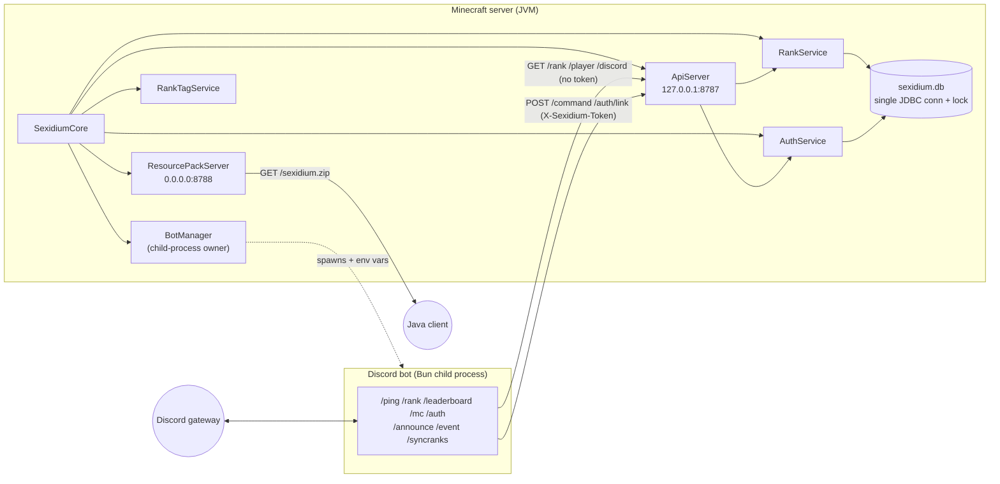

# Networking, Discord Bot, Auth, Ranks & Persistence

This subsystem connects the Minecraft server to an out-of-process Discord bot and backs both with a single SQLite store. It owns two in-JVM HTTP servers, the bot child-process lifecycle, the Discord account-linking flow, the rank-class system (with in-game and Discord tags), and the shared `sexidium.db` schema. Everything Java-side lives in the platform-agnostic `core` module; the adapters only supply their slice of the SPI (`ServerAdapter` on Paper, `NodeRuntime` on Velocity), open the `Database`, build the `AuthService`, and paint rank tags (Paper). See sibling docs for [game framework](../architecture/game-framework.md), [social/lobby](../gameplay/lobby-worlds-and-social.md), [experiences](../gameplay/experiences.md), and the [menu system & art](../interface/menus.md) the resource-pack server delivers.

## Topology

Two HTTP servers now run in the JVM, with different reach:

| Server | Bind | Default port | Audience | Thread |
|---|---|---|---|---|
| [`ApiServer`](../../packages/core/src/main/java/com/sexidium/core/lib/net/ApiServer.java) | `127.0.0.1` (loopback) | `8787` | the local Discord bot only | `Sexidium-API` |
| [`ResourcePackServer`](../../packages/core/src/main/java/com/sexidium/core/lib/net/ResourcePackServer.java) | `ui.resource-pack.bind` (default `0.0.0.0`, **public**) | `8788` | players' Minecraft clients | `Sexidium-Pack` |

The bot↔server channel is **HTTP-only**. All five bot data paths (`GET /rank`, `GET /player`, `GET /discord`, `POST /command`, `POST /auth/link`) go over the loopback bridge. The bot never opens `sexidium.db` — account linking is performed Java-side over `POST /auth/link`, so the JVM is the sole writer of the database file.

### Wiring

All objects are constructed in [`SexidiumCore`](../../packages/core/src/main/java/com/sexidium/core/SexidiumCore.java) and started in `start()` (`SexidiumCore.java:99-101`: `apiServer.start()`, `resourcePackServer.start()`, `botManager.start()`), stopped in reverse (`:124-126`). Key constructions:

- `ApiServer` takes `(serverAdapter, rankService, authService)` (`:72`) — it holds `AuthService` directly so linking runs server-side.
- `RankService` (and `MatchRepository`/`FriendService`) is **null** when `dependencies.database()` is null; the system degrades gracefully (`/rank` returns `[]`). `RankAwardPort.noop()` replaces it for game code (`:75`). `ApiServer`, `ResourcePackServer`, and `BotManager` are always constructed.
- `RankTagService` is built at `:91` and applied to each player on join via the platform event bridge (`PaperEventBridge.java:76` → `core.rankTags().apply(player)`).

## HTTP API server (`ApiServer`)

A JDK `com.sun.net.httpserver.HttpServer` bound to `127.0.0.1` on `api.port`, served by one daemon thread. Disabled entirely when `api.enabled: false` (`ApiServer.java:46-49`). At start it warns that the write bridges are **disabled** while `api.token` is unset or still the shipped default (`:52-55`).

### Endpoints

| Method | Path | Token | Success | Notes |
|---|---|---|---|---|
| `GET` | `/health` | no | `200 {"ok":true}` | |
| `GET` | `/rank?limit=N` | no | `200` array of `LeaderboardEntry` | aggregated by Discord account (`rankService.topAggregated`); `limit` default `10`, clamped `1..100` |
| `GET` | `/player?name=X` | no | `200` one `LeaderboardEntry` | `400` blank name, `503` ranks unavailable, `404` unknown name |
| `GET` | `/discord?id=X` | no | `200` one `LeaderboardEntry` | aggregated for a Discord user id; `400`/`503`/`404` as above |
| `POST` | `/command` | yes | `200` | runs a console command |
| `POST` | `/auth/link` | yes | `200` | consumes an auth code and links a Discord account |

Wrong verbs return `405 {"error":"method"}`.

### Token-gated write endpoints

Both `/command` and `/auth/link` refuse to run when `api.token` is null/blank **or** still the shipped default `change-me-please` (`DEFAULT_TOKEN`, `:30`), returning `503` (`:154-158`, `:218-221`). The token is compared with the `X-Sexidium-Token` header in **constant time** via `MessageDigest.isEqual` (`constantTimeEquals`, `:199-206`); a missing/mismatched header is `401`.

- **`POST /command`** (`handleCommand`, `:148`): reads the raw body, strips a leading `/`, checks the optional `api.command-allowlist` (`commandAllowed`, `:185-197` — an empty/absent list allows any command; otherwise the command's first word must be listed), then dispatches on the main thread via `serverAdapter.scheduler().runNow(() -> commands().dispatchFromConsole(cleaned))`. A blocked command returns `403 {"error":"command not allowed"}`; an empty body `400`. `dispatchFromConsole` runs as the server console (operator authority).
- **`POST /auth/link`** (`handleAuthLink`, `:212`): parses an `application/x-www-form-urlencoded` body (`parseForm`, `:251-265`) for `code`, `discordUserId`, `discordUsername`, `discordGlobalName`, `discordAvatar`; requires `code` + `discordUserId` (else `400`); calls `authService.consumeCode(...)` and returns `{"status":<token>,"minecraftName":...}`. `503` when `authService` is null.

### Read endpoints & JSON

Read endpoints are **not** token-checked and the `LeaderboardEntry` JSON includes `discordUserId`, the `names[]` alt list, `rankClass`, and `rankColor` — only the loopback bind limits exposure. JSON is hand-serialized by [`Json`](../../packages/core/src/main/java/com/sexidium/core/lib/net/Json.java); the live `/rank`, `/player`, `/discord` paths serialize `LeaderboardEntry` (`Json.of(LeaderboardEntry)`, `Json.java:39-55`). `Json.of(Profile)` still exists but is no longer on a live path.

## Real-time bridge — WebSocket RPC engine

The live channel between Java and the bot is a **single loopback WebSocket** carrying a tRPC-style typed contract; the HTTP `ApiServer` above is kept only for health checks / backwards compatibility. The bot **hosts** the WebSocket server (Bun) and the Java server **connects to it as a client** using the JDK's `java.net.http.WebSocket` (no new Java deps) — this fits the "Java launches the bot" model, with an automatic reconnect loop since the bot's server may not be up yet.

- **Single source of truth:** [`bot/src/types/contract.ts`](../../bot/src/types/contract.ts) — Zod schemas for every DTO, `procedures` (bot→Java request/response) and `events` (Java→bot push). The TS side is fully inferred + runtime-validated; the Java side hand-implements matching handlers in [`BridgeRouter`](../../packages/core/src/main/java/com/sexidium/core/lib/net/BridgeRouter.java).
- **Transport:** [`BridgeClient`](../../packages/core/src/main/java/com/sexidium/core/lib/net/BridgeClient.java) (Java) ↔ `bot/src/minecraft/{server,client,events,codec}.ts`. Frames are correlated envelopes `{id,type,method,payload}`; `hello` carries the `api.token` handshake. Inbound JSON is parsed by the dependency-free [`JsonReader`](../../packages/core/src/main/java/com/sexidium/core/lib/net/JsonReader.java) (the read counterpart to `Json`).
- **Procedures:** `rank.top`/`rank.byName`/`rank.byDiscord`, `server.command`/`server.info`/`server.restart`/`server.stop`, `console.tail`, `skin.get`, `auth.link`. Token/allowlist gating on the command/restart procedures matches the old `/command` rules (a failed call returns an `err` frame whose token the bot maps to a message: `disabled`/`forbidden`/`unauthorized`).
- **Events (Java → bot, real-time):** `player.join`/`player.leave` (from `GameEventRouter`), `rank.changed` (from `RankService`'s change listener → live Discord role/nick refresh), `console.line` (opt-in via `api.rpc-console-events`), `server.status` (heartbeat). The bot's `discord/events/ready.ts` subscribes and relays to `LOG_CHANNEL_ID` / `EVENTS_CHANNEL_ID`.
- **Platform ports** (core interfaces, Paper impls): [`ServerInfoPort`](../../packages/core/src/main/java/com/sexidium/core/platform/ServerInfoPort.java) (address/port/online/version/TPS), [`SkinPort`](../../packages/core/src/main/java/com/sexidium/core/platform/SkinPort.java) (SkinsRestorer texture via `PaperSkinPort`→`PaperNpcSkinResolver`), [`ConsoleTap`](../../packages/core/src/main/java/com/sexidium/core/platform/ConsoleTap.java) (`PaperConsoleTap`, a JUL root-logger handler — captures plugin/Bukkit lines, not raw vanilla log4j). Other platforms return the empty defaults.

**Skins for rank cards:** `skin.get` returns the Mojang texture property; the bot decodes it to the skin PNG URL and composites a 2D head (`bot/src/lib/skin.ts` + `ui/components/skin-avatar.tsx`), so rank/leaderboard cards show the player's real SkinsRestorer skin.

**Networked-DB requirement:** because the bot now also reads the database directly via TypeORM ([`bot/src/database/`](../../bot/src/database), entities mirror `SchemaMigrator`), it cannot share an embedded SQLite file. When `bot.enabled: true` the plugin **requires MySQL/Postgres** and refuses to boot on SQLite (`PaperSexidiumPlugin.onEnable`). `BotManager` injects `RPC_PORT` + `DB_TYPE/HOST/PORT/NAME/USER/PASSWORD` into the bot for the networked backend.

## Discord bot — Java side (`BotManager`)

[`BotManager`](../../packages/core/src/main/java/com/sexidium/core/bot/BotManager.java) launches and supervises the bot as a child process; it does nothing unless `bot.enabled: true` and `bot.token` is non-blank, recording a `lastStartError` otherwise (`:59-69`).

`launch()` runs on the daemon thread `Sexidium-Bot-Start` (`:143`):

1. **Extract bundled source** (`extractBundleIfNeeded`, `:352`): copies jar entries under `bot/`, `runtime/`, `packages/` into the data dir; idempotent via a per-jar marker `bot/.extracted-<len>-<mtime>`.
2. **Resolve the runtime** (`resolveRuntime`, `:206`): the bun runtime is **dynamically downloaded**, not bundled. When `bot.download-runtime: true` (default) and `<data>/runtime/bun` is missing, `downloadBun` (`:232`) fetches the OS/arch-matched asset from `oven-sh/bun` GitHub releases, pinned by `bot.bun-version` (default `latest`), and unzips the single `bun` binary. `bunAssetName` (`:277`) picks `bun-windows-x64` / `bun-darwin-aarch64|x64` / `bun-linux-aarch64|x64-baseline`. Falls back to `bot.runtime-command` (`bun` on `PATH`) on failure or when `download-runtime: false`.
3. **Install deps** (`installDependencies`, `:294`): runs `<runtime> install --no-save`, guarded by a fingerprint marker `.node_modules-installed` keyed on `os.name + os.arch + runtime + stat(package.json) + stat(bun.lock)`; wipes `node_modules` on fingerprint change.
4. **Launch** `bun run <botDir>/src/index.ts` with `redirectErrorStream`; stdout is pumped to the server log as `[bot] …` (`Sexidium-Bot-Log` thread), keeping the last `MAX_RECENT_LOGS = 20` lines for `/sx admin bot logs`.

**Injected env vars** (`launch`, `:174-181`):

| Env var | Source |
|---|---|
| `BOT_TOKEN` | `bot.token` |
| `API_URL` | `http://127.0.0.1:<api.port>` |
| `API_TOKEN` | `api.token` (header value for write endpoints) |
| `GUILD_ID` | `bot.guild-id` (optional; instant per-guild slash registration) |
| `ADMIN_ROLE_ID` | `bot.admin-role-id` (optional; role allowed to use `/mc`) |
| `DATABASE_PATH` | absolute `sexidium.db` path, **only when** `database != null` |

`DATABASE_PATH` is still injected but the current bot never opens it. `stop()` does `destroy()`, waits 5s, then `destroyForcibly()` (`:79-101`). `status()` returns a `BotStatus` record; secrets are reported only as `configured`/`empty` (`configuredState`). The `BotStatus.useBundledRuntime` field is a **legacy name** — it is populated from `bot.download-runtime` (`:122`).

## Discord bot — TypeScript app (`/bot`)

Built on the **`@constatic/base`** framework (Bun runtime). `index.ts` starts the RPC WebSocket server + TypeORM connection, then calls `bootstrap({ meta, env })`. Env is validated by Zod (`env.ts`): `BOT_TOKEN` required; `RPC_PORT` (default `8789`), `DB_TYPE`/`DB_HOST`/`DB_PORT`/`DB_NAME`/`DB_USER`/`DB_PASSWORD`, `API_TOKEN`, `GUILD_ID`, `ADMIN_ROLE_ID`, `LOG_CHANNEL_ID`, `EVENTS_CHANNEL_ID` optional.

**Folder structure (modular, 100% type-safe):**

| Dir | Purpose |
|---|---|
| `src/types/` | `contract.ts` (the Zod procedure/event single source of truth) + inferred `dto.ts` + card view-models |
| `src/minecraft/` | RPC engine: `server.ts` (Bun WS server), `client.ts` (`mc.*` typed caller), `events.ts` (typed bus), `codec.ts`; `minecraft/auth/` (link flow) |
| `src/database/` | TypeORM `DataSource` (`synchronize:false`) + `entities/` (one per Java table, `extends BaseEntity`) |
| `src/ui/` | `components/` (React/satori) + `images/` (one `renderCard` engine + thin per-card wrappers) |
| `src/lib/` | `fonts`/`glyphs`/`color`/`discord-theme`/`ranks`/`rank-sync`/`staff`/`skin` |
| `src/discord/` | `commands/` + `events/` (RPC→Discord relays) |

Eleven slash commands (`discord/commands/index.ts`) — all reach the server through `mc.*` (`src/minecraft/client.ts`) over the WebSocket, not HTTP:

| Command | Procedure | Gate | What it does |
|---|---|---|---|
| `/ping` | — | — | framework default |
| `/rank [player]` | `rank.byName` / `rank.byDiscord` + `skin.get` | none | satori profile card with the player's real skin head; on your own card also runs `syncMemberRank`. Text fallback |
| `/leaderboard` | `rank.top` + `skin.get` | none | satori leaderboard card; text fallback |
| `/serverinfo` | `server.info` | none | satori card: address, port, players online, version |
| `/mc <command>` | `server.command` | `isStaff` | runs a console command |
| `/restart` | `server.restart` | staff | restarts (needs a process wrapper) / stops the server |
| `/console [lines]` | `console.tail` | staff | shows the latest buffered console lines |
| `/auth <code>` | `auth.link` | none | links the caller's Discord account |
| `/announce <message>` | `server.command` (`say [Discord] …`) | staff | broadcast |
| `/event` | — (Discord scheduled event + satori banner) | staff | |
| `/syncranks` | `rank.byDiscord` per member | staff | ensures one role per rank class, then re-names + re-roles every linked member |

- **Real-time relays** (`discord/events/ready.ts`): subscribes to the typed event bus — `console.line`→`LOG_CHANNEL_ID`, `player.join`/`leave`→`EVENTS_CHANNEL_ID`, `rank.changed`→live `syncMemberRank`.
- **Helpers**: `minecraft/client.ts` (`mc.*`, `runServerCommand`, `RunResult`); `lib/rank-sync.ts` (`ensureRankRoles`, `syncMemberRank`); `lib/ranks.ts` (mirror of Java `RankClass`); `lib/skin.ts` (`skinHeadDataUri`); `lib/staff.ts`. The staff gate is **client-side only** — no server-side protection if the token leaks. The old `bot/src/auth/` direct-SQLite subtree and `sql.js` were removed; `pg`/`mysql2` power TypeORM.

### Docker debug stack

`docker-compose.yml` (+ `docker/Dockerfile.paper`, `scripts/docker-paper-entry.sh`) brings up **Postgres** + a **paper** service that builds the plugin and runs `scripts/init-paper.sh`. The script's `configure_sexidium_networked_backend_if_present` seeds the generated config for the networked backend + bot from `SEXIDIUM_*` env. The bot token comes from a gitignored root `./.env` (`docker/.env.example`), never committed. Run: `SEXIDIUM_BOT_TOKEN=… docker compose up --build`. That stack is for local debugging only; the real multi-node deployment (proxy + lobby + workers on one shared database) is covered in [deployment.md](deployment.md).

## Auth (account-linking) flow

A link ties a Minecraft UUID to a Discord user id. Minecraft **generates** a code; Discord **consumes** it. Codes are stored only as `SHA-256(normalized)`.

### Code generation (Java)

`/sx auth` (`CoreCommandService#handleAuth`, `:1220-1244`) or the login gate (`AuthLoginService.verify`) call `AuthService.createCode` (`AuthService.java:26-55`):

1. If auth disabled → `DISABLED`.
2. If `discord_accounts` already has this UUID → `ALREADY_LINKED`.
3. Else generate a code from `auth.code-characters` (sanitized to `[A-Z0-9]`, falling back to digits `2-9` if fewer than 2 usable chars), length clamped `4..16`, expiry `now + max(1s, ttl)`. `createPendingCode` (`AuthRepository.java:52-84`) deletes prior unconsumed codes for that UUID, inserts the hashed code, and upserts the `players` row. Up to 8 retries on hash-PK collision. Returns `CREATED` with the **plaintext** code (only ever returned to the player; the DB holds only the hash).

`AuthCodeResult.Status = { CREATED, ALREADY_LINKED, DISABLED }`.

### Code consumption (Java, via the bridge)

`POST /auth/link` → `ApiServer.handleAuthLink` → `AuthService.consumeCode` (`:66`) → `AuthRepository.consumeCode` (`:91-176`), all under `db.lock()` on the single JDBC writer:

1. Look up `auth_codes` by hash → `INVALID` if none.
2. Reject `ALREADY_USED` (`consumed_at` set) or `EXPIRED` (`expires_at < now`).
3. Reject `MINECRAFT_ALREADY_LINKED` if that UUID already has a `discord_accounts` row.
4. Insert `discord_accounts` (`+ discord_username`/`global_name`/`avatar`), upsert `players.discord_user_id`, mark the code consumed.

**One-Discord → many-Minecraft is intentional**: `consumeCode` deliberately does *not* reject when the Discord user already owns other Minecraft names (`AuthRepository.java:135-136`). `AuthResults.AuthLinkResult.Status` (`AuthResults.java:40`) still defines `DISCORD_ALREADY_LINKED` (the bot still handles its token), but the Java path never returns it. `statusToken()` (`AuthResults.java:51`) maps to the exact strings the bot switches on.

### Login gate

`AuthLoginService.verify` (`:48-78`) is hooked on Paper at `AsyncPlayerPreLoginEvent` and on the network at the proxy's pre-login event:

- Allow if auth disabled **or** `require-for-login` is off.
- **Fail-closed** (reject) if `authService` is null or a `SQLException` occurs.
- Allow if already linked.
- Else mint a code and reject with a bilingual (EN + pt-BR) disconnect message (`bilingual()`, `:103-111`) telling the player to run `/auth <code>` in Discord.

`require-for-login` is **tri-state** `auto`/`true`/`false` (`requireForLogin`, `:81-89`), default `auto` = on iff a bot is configured (`bot.enabled` AND `bot.token` non-blank, `botConfigured()` `:91-97`). Shipped `config.yml` sets `auto` (`config.yml:849`), so login **is** gated whenever the bot is enabled and tokened.

`AuthService.unlinkByMinecraftName` / `AuthRepository.unlinkByMinecraftName` exist but remain **unwired** (no command invokes them; tests only).

## Ranks & rank classes

[`RankService`](../../packages/core/src/main/java/com/sexidium/core/data/RankService.java) implements `RankAwardPort`; games call it via `GameContext.ranks()`. Award methods:

| Method | Delta | Config key |
|---|---|---|
| `awardParticipation` | `+participate` points, `+1 game` | `ranks.award.participate` |
| `awardKill` | `+kill` points, `+1 kill` | `ranks.award.kill` |
| `awardWin(modeId)` | `+winPoints(modeId)` points, `+1 win` | mode-specific (below) |
| `awardPlaytime(seconds)` | `+seconds·perMinute/60` points only (no game/win/kill) | `ranks.award.experience-per-minute` |

**Points model.** Every minigame participant earns `participate` points on joining the match (the "some points even if you lose"); winners earn the larger mode-specific `winPoints` on top, and kills earn `kill` each. The open-ended **experience modes (Experience + Chaos)** have no win/lose, so they earn purely by **time in world**: `AbstractGame.startExperiencePlaytimeAwards()` runs a tracked timer every `ranks.award.experience-interval-seconds` (default 60s) that calls `awardPlaytime` for each still-online participant.

`winPoints` maps `modeId` → config: `race`→`race-win` (100), `gather`→`duel-win` (120), `tntwar`→`tntwar-win` (90), `combat`→`combat-win` (80), `fugitive`→`fugitive-win` (130), default→`participate`. An unmatched `modeId` now falls back to the `participate` key **with its participate default (10)**, not the 100-point win default, so a future mode can't silently earn a full win.

`award()` always resolves the player's linked Discord id best-effort (so a linked player's alts keep aggregating even when a link isn't required), then skips the upsert and optionally reminds with `AUTH_POINTS_REQUIRE_LINK` **only** when `requiresLinkedAccount()` (`auth.enabled` AND `auth.require-linked-for-points`, default **false**) and there is no linked id. By default players level up without `/sx auth`. Otherwise it enqueues onto the single-thread `Sexidium-DB` writer. `upsert` (`:290`) does `INSERT … ON CONFLICT(uuid) DO UPDATE` accumulating deltas, with `discord_user_id=COALESCE(excluded, existing)` so an award never nulls an existing link, then a second `UPDATE` recomputing `level = points / points-per-level` (default 100). `level = max(0, points / max(1, points-per-level))`.

### Aggregated reads

The read API aggregates by Discord account: `topAggregated`/`aggregateByName`/`aggregateByDiscordId` (`:163-210`) sum points/wins/kills/games across **every** Minecraft name linked to the same `discord_user_id` and return a `LeaderboardEntry` (`discordUserId`, representative name, `names[]`, totals, level, `rankClass`, `rankColor`). `aggregateByName` falls back to the single player's row when the name is unlinked, and returns null when the name is unknown. Legacy `top()`/`byName()` (returning `Profile`) still exist and filter `discord_user_id IS NOT NULL` when linked accounts are required.

### Rank classes & tags

[`RankClass`](../../packages/core/src/main/java/com/sexidium/core/data/RankClass.java) — seven classes worst→best with `minLevel` thresholds and hex colours:

| Class | Color | minLevel |
|---|---|---|
| Omega | `#9AA0A6` | 0 |
| Epsilon | `#57F287` | 5 |
| Delta | `#1ABC9C` | 10 |
| Gamma | `#3498DB` | 20 |
| Beta | `#9B59B6` | 35 |
| Alpha | `#F0B232` | 55 |
| Sigma | `#E74C3C` | 80 |

`forLevel(level)` picks the highest class whose threshold is met. The TS bot mirrors this in `bot/src/lib/ranks.ts`; the HTTP bridge sends the resolved class/colour so the bot never re-derives thresholds.

[`RankTagService`](../../packages/core/src/main/java/com/sexidium/core/data/RankTagService.java) resolves a player's `RankClass` from their **aggregated** score and paints it onto the in-game name via the platform `RankTagAdapter` (native scoreboard team, `NOOP` default). `teamName` prefixes a priority digit so the best rank sorts to the top of tab; `prefixMini` renders `<#hex><bold>[Class]</bold> `. Applied on join (`PaperEventBridge.java:76`) and re-applied on demand (e.g. `/sx rank` on yourself). Core SPI: [`RankTagAdapter`](../../packages/core/src/main/java/com/sexidium/core/platform/RankTagAdapter.java); Paper impl: `PaperRankTagAdapter`. [`LeaderboardEntry`](../../packages/core/src/main/java/com/sexidium/core/lib/data/LeaderboardEntry.java) is the single shape the bridge serializes.

## Resource pack server (`ResourcePackServer`)

A second JDK `HttpServer` (`Sexidium-Pack`) hosts the generated menu resource pack so Java clients auto-download it on join (the adapter calls `setResourcePack(url, sha1)`). Unlike `ApiServer` it binds a **public** address.

- Disabled when `ui.resource-pack.enabled: false` (`:63-66`).
- When `ui.resource-pack.url` is set, this server stays **off** and the external host is advertised with `ui.resource-pack.sha1` (falling back to the generated hash with a warning) (`:75-93`).
- Otherwise it binds `ui.resource-pack.bind` (default `0.0.0.0`) on `ui.resource-pack.port` (default `8788`), serving `GET`/`HEAD /sexidium.zip` (`:108-121`). `ui.resource-pack.host` advertises the public address — required for remote players; if unset it warns and advertises `127.0.0.1`/the bind.
- Builds the pack from textures bundled under `bundled/menupack-textures/` (placeholder art if absent). Any failure degrades to "no pack" (Java clients keep plain chest menus) and never crashes plugin enable (`:122-129`).

See the [menu system & art](../interface/menus.md) doc for the art layer this delivers.

## Persistence — `sexidium.db`

A single SQLite file (`database.file`, default `sexidium.db`) accessed through one JDBC connection guarded by one `Object` lock ([`Database`](../../packages/core/src/main/java/com/sexidium/core/lib/data/Database.java)). The lock is shared by the game thread, the `Sexidium-DB` writer, and the `Sexidium-API` thread. Because the bot no longer touches the file, **all writers are Java-side and fully serialized** — the old cross-process lost-update race is gone.

[`SchemaMigrator.migrate`](../../packages/core/src/main/java/com/sexidium/core/lib/data/SchemaMigrator.java) sets `PRAGMA journal_mode=DELETE`, creates all tables/indexes idempotently, and back-fills columns via `addColumnIfMissing`.

| Table | Key columns / purpose |
|---|---|
| `players` | `uuid` PK, `name`, `discord_user_id`, `points`, `level`, `wins`, `kills`, `games`, `updated_at` |
| `discord_accounts` | `minecraft_uuid` **PK** (one-to-many), `discord_user_id` (NOT NULL, **non-unique**), `minecraft_name`, `discord_username`, `discord_global_name`, `discord_avatar`, `created_at`, `updated_at` (`:38-48`) |
| `auth_codes` | `code_hash` PK, `minecraft_uuid`, `minecraft_name`, `created_at`, `expires_at`, `consumed_at`, `consumed_discord_user_id` |
| `command_queue` | **dead schema** — created but never read/written |
| `matches`, `match_players` | match reconnect (see [game framework](../architecture/game-framework.md)) |
| `friends`, `friend_requests` | social (see [lobby unification](../gameplay/lobby-worlds-and-social.md)) |
| `experiences` (+`challenge_state`), `experience_players` | experiences (see [experiences](../gameplay/experiences.md)) |

Indexes: `idx_players_discord_user_id` is now a **plain partial** index `WHERE NOT NULL` — the old UNIQUE index is explicitly dropped (`:137-141`) because one Discord may own many players. Also `idx_players_name_nocase`, `idx_auth_codes_lookup` on `(code_hash, expires_at, consumed_at)`, `idx_discord_accounts_user`, `idx_experiences_owner`, `idx_match_players_uuid`, `idx_friend_requests_to`.

`migrateDiscordAccounts` (`:199-222`) rebuilds a legacy one-to-one `discord_accounts` table (detected by a missing `discord_username` column) into the new one-to-many schema; a fresh DB is created directly with the new schema.

**Schema authority:** `SchemaMigrator.java` is now the *only* authoritative DDL. The legacy [`db/migrations/001_auth.sql`](../../packages/core/src/main/resources/db/migrations/001_auth.sql) is **stale** (still has the old one-to-one `discord_accounts` and a UNIQUE players index) and `bot/src/auth/entities.ts` is dead code — neither is applied at runtime.

## Configuration reference

| Key | Default | Notes |
|---|---|---|
| `database.file` | `sexidium.db` | |
| `ranks.points-per-level` | `100` | |
| `ranks.award.participate` / `kill` | `10` / `15` | participate is also the "loser" reward (earned on match join) |
| `ranks.award.{race,duel,tntwar,combat,fugitive}-win` | `100`/`120`/`90`/`80`/`130` | unmatched mode defaults to participate, not 100 |
| `ranks.award.experience-per-minute` | `2` | points/min of time in Experience/Chaos worlds |
| `ranks.award.experience-interval-seconds` | `60` | how often playtime points are granted (min 5) |
| `auth.enabled` | `true` | |
| `auth.require-for-login` | `auto` | tri-state `auto`/`true`/`false`; `auto` = on iff a bot is configured |
| `auth.code-expiry-seconds` / `code-length` / `code-characters` | `600` / `6` / `'23456789'` | length clamped `4..16` |
| `auth.require-linked-for-points` / `remind-unlinked-on-award` | `false` / `true` | `false` = unlinked players still earn points & level up |
| `api.enabled` / `api.port` | `true` / `8787` | |
| `api.token` | `change-me-please` | **default DISABLES** `/command` and `/auth/link` |
| `api.command-allowlist` | `[]` | first-word allowlist; empty = allow any |
| `bot.enabled` / `bot.token` / `bot.guild-id` / `bot.admin-role-id` | `false` / `''` / `''` / `''` | |
| `bot.download-runtime` / `bot.bun-version` / `bot.runtime-command` | `true` / `latest` / `bun` | download replaces the old bundled runtime |
| `ui.resource-pack.{enabled,url,sha1,host,bind,port,required,prompt}` | `true`/`''`/`''`/`''`/`0.0.0.0`/`8788`/`false`/… | |

## Player & admin commands (`/sx`)

| Command | Perm | Handler | Notes |
|---|---|---|---|
| `/sx auth` | `sexidium.play`/`sexidium.auth` | `handleAuth` (`:1220-1244`) | localized `AUTH_*` keys |
| `/sx top` | play | `GameCommands.handleTop` | aggregated leaderboard view |
| `/sx rank [player]` | play | `GameCommands.handleRank` | aggregated profile view |
| `/sx admin bot status\|start\|stop\|restart\|logs\|reload\|config` | `sexidium.admin` | `BotCommands.handle` | hardcoded English MiniMessage (cosmetic inconsistency); `sendBotConfig` prints `download=<status.useBundledRuntime()>`, which reflects `bot.download-runtime` |

## Security & correctness notes

- **Resolved** — cross-process lost-update race: the bot no longer opens `sexidium.db`; linking is a token-gated `POST /auth/link` on the single Java writer.
- **Resolved** — default token exposure: both write endpoints return `503` while `api.token` is blank or `change-me-please`; the comparison is constant-time (`MessageDigest.isEqual`).
- **Mitigated** — `/command` can be constrained by `api.command-allowlist` (first-word match). An empty list still runs arbitrary console commands (token-gated, loopback-bound), so the concern is reduced but not eliminated by default.
- **Open (medium)** — `GET /rank` / `/player` / `/discord` are unauthenticated and leak `discordUserId` and the `names[]` alt list; only the `127.0.0.1` bind limits exposure.
- **Open (low)** — auth-code consumption is not bound to a specific Discord account and is unthrottled server-side (only Discord interaction rate limits apply). Default 6-char numeric space + 600s TTL.
- **Info** — dead code/schema: `bot/src/auth/*` and the `sql.js`/`typeorm` deps are orphaned; `001_auth.sql` and `entities.ts` are stale schema copies never applied at runtime; `command_queue` is dead schema; `AuthService.unlinkByMinecraftName` is unwired.
- **Info** — `bot/.env.example` references `bun run src/main.ts`, but the real entrypoint is `src/index.ts` (what `BotManager` runs).

## Keeping this current

Source of truth is the code; this doc is a derived view. Authoritative files: `net/ApiServer.java`, `net/ResourcePackServer.java`, `bot/BotManager.java` + the `bot/` TypeScript tree (`index.ts`, `discord/commands/*`, `lib/*`), `auth/AuthService.java` + `AuthRepository.java` + `AuthLoginService.java` + `AuthLinkResult.java`, `data/RankService.java`, `rank/RankClass.java` + `RankTagService.java` + `platform/RankTagAdapter.java`, `lib/data/SchemaMigrator.java` + `LeaderboardEntry.java`, `lib/net/Json.java`, and `config.yml`. Update **this doc in the same change** that touches those files. Triggers: a new endpoint or HTTP server; a new/removed bot command; a schema table/column/index change; a new `RankClass` or threshold/colour change; any `api.*`/`bot.*`/`auth.*`/`ranks.*`/`ui.resource-pack.*` config key added or removed; a change to the token-gating, allowlist, or login-gate behaviour.
